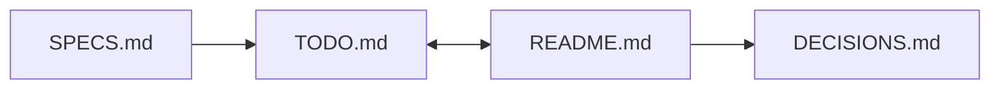



I recently gave a workshop at inmind.ai about a framework I use to work with AI. The framework I presented was simple: define what you are trying to do, find what is missing, check the work, and most importantly, own the decision.

# The Age of Cheap Information

AI has made information incredibly cheap.

I can now give a model a question and get an explanation in seconds. I can give it a folder of scientific papers and get a literature review. I can give it a codebase and ask it to explain how the system works. I can give it a problem and ask it to explore possible solutions.

This can be useful, but it creates a problem that I think we are still learning how to deal with.

When information becomes easy to produce, it also becomes easy to feel that we understand something before we actually do.

## What you see is all there is

In _Thinking, Fast and Slow_, Daniel Kahneman describes a tendency he calls WYSIATI: What You See Is All There Is.

We form judgments from the information available to us. Once that information forms a coherent story, we tend to feel that we have enough to make a decision.

Let's consider a simple example.

Imagine that a neighborhood is choosing a tree species to plant throughout the area. After consulting the experts, they recommend a white blossom species that is inexpensive, looks good, and provides a consistent appearance across the neighborhood. Based on the information available, it seems like a reasonable choice.

Then we learn that a local disease specifically targets that species.

The original information was not necessarily wrong. The problem was that an important piece of information was missing.

*The white blossom tree example from the inmind workshop.*

AI creates a similar situation.

A model can take the information we give it and produce a very coherent explanation or recommendation. The explanation can be reasonable given its context. The problem is that the model is not responsible for determining whether the context contains everything that matters to the decision.

That responsibility remains with the person using it.

This is one reason I am careful about asking AI to review a conclusion that I have already reached. If I tell a model that I believe Supplier A is the best option for our GPUs and then ask it to review my reasoning, I have already given it the answer.

## Disempowerment and the temptation to delegate

In 2023, Anthropic's research[^anthropic-23] found that this behavior appeared across several RLHF-trained models, and their analysis suggests that human preference judgments can contribute to it. In some cases, human raters and preference models preferred a convincingly written response that agreed with the user over a response that was more correct.

A theory was that models can exhibit *sycophantic behavior* - fancy word meaning that they can become overly agreeable to a user's stated beliefs or position.

Architecturally, a language model is trained to produce responses that are useful and desirable according to its training signal. During preference optimization, responses that people prefer receive a stronger training signal. Agreement can therefore become part of what the model learns to produce, even when agreement is not the same thing as truth.

There is also another part of this problem that has less to do with the model and more to do with us, and I think it links nicely to Kahneman's System 1 and System 2.

Making a difficult decision takes effort, a sort of "moral fatigue," if you will. It also means accepting responsibility for an outcome that we cannot predict with certainty. When an AI system can produce a confident answer in a few seconds, there is a natural temptation (System 1) to let it make the difficult parts of the decision for us.

This applies to technical decisions, but it can also apply to decisions involving people, priorities, and values.

>[!check] This is where I think we need to make a personal decision about what we will and will not delegate to AI.
>
>I can delegate research. I can delegate summarization. I can ask AI to explore alternatives, find missing information, review a document, or point out assumptions that I may have overlooked.
>
>I still need to decide what I believe and what I am willing to take responsibility for.

Later, in 2026, Anthropic published _Disempowerment Patterns in Real-World AI Usage_[^anthropic-26] and tried to answer this question:

> **What happens when people increasingly let AI participate in their beliefs, values, and actions?**

They define **severe disempowerment** as:

> when an AI's role in shaping a user's beliefs, values, or actions has become so extensive that their autonomous judgment is fundamentally compromised

To measure it, they analyzed approximately **1.5 million Claude conversations** from December 2025, and they looked specifically at three things:

1. People's beliefs about reality become less accurate.
2. Their value judgments drift away from those they hold.
3. Their actions become misaligned with their values.

See [Anthropic's full research on disempowerment patterns](https://www.anthropic.com/research/disempowerment-patterns).

Consider a simple example.

Suppose the model is perfectly non-sycophantic.

You ask:

> "I have three possible bowtie colors. Which should I choose?"

The model gives you an answer.

Then you say:

> "Okay, I'll do exactly that."

There is no obvious sycophancy here. The model did not necessarily agree with you.

**You simply delegated the judgment.**

## Your environment matters

Using AI responsibly is partly a personal discipline and partly a property of the environment you work in.

It is difficult to maintain personal accountability in a team where nobody asks you why a decision was made. If an AI-generated implementation works, the team may have little reason to investigate how it was produced or whether the underlying assumptions were sound. Naturally, technical debt accumulates faster than they can keep up.

At Gaya, we own projects end to end, but we still hold each other accountable for the decisions we make. If I make an architectural choice, I should be able to defend it. And to state the obvious, nobody accepts "Claude wrote it" as an explanation.

I can use AI extensively because I know that I will still have to explain the result to someone else.

>[!check] A good environment makes it harder to hide behind the tool.

## A practical workflow

Once I started thinking about the problem this way, I wanted a practical way to keep responsibility explicit while still taking advantage of what AI is good at.

The result is a simple workflow built around three files:

- `SPECS.md`
- `TODO.md`
- `DECISIONS.md`

They are just Markdown files. The useful part is the process around them.

### `SPECS.md`

Start with the requirements, and ask questions to identify missing information. Remember the white blossom example.

AI can help turn 10 documents into something more structured, but the important part is that I do not want to miss important assumptions.

If the client asks for a RAG system, there are many questions that need to be answered:

1. What's the latency budget?
2. Is the content multimodal? How does the data look?
3. Are there any languages other than English?
4. What happens if information is missing?
5. ...

Those questions can be brainstormed with AI, sure. The answers still need to come from the people who own the requirements.

`SPECS.md` becomes the place where we record what we actually agreed to build, including the requirements, constraints, examples, expected output, and owner.

### `TODO.md`

There will always be questions that cannot be answered immediately. Some require information from the client, others require research or input from another team.

I put these questions in `TODO.md`.

This is also a useful place to use AI. I can give it the current specification and ask it to identify information that is still missing. I can then separate those gaps into things we need to learn internally, things we need to ask stakeholders, and things that require external research.

Spend time asking how each missing piece of information could affect the result.

### `DECISIONS.md`

Eventually, someone has to choose.

I keep those decisions in `DECISIONS.md`. For each meaningful decision, I want to know when it was made, who made it, what was decided, which alternative was rejected, why it was rejected, and what would cause us to revisit the decision.

| Date + Owner                    | Decision                                    | Why                                               | Rejected Alternative                                             | Revisit Trigger                                       |
| ------------------------------- | ------------------------------------------- | ------------------------------------------------- | ---------------------------------------------------------------- | ----------------------------------------------------- |
| 2026-08-24 · Architecture owner | Use prompt chaining for document review     | Fixed stages; each step has clear review criteria | Autonomous agent - unnecessary variability and unclear ownership | Reassess when 30%+ cases need adaptive branching      |
| 2026-08-24 · HR policy owner    | Ground FAQs only in approved policy sources | Answers must trace to official language           | Open-web synthesis - not authoritative for company policy        | Reassess when a new policy version is approved        |
| 2026-08-24 · Finance owner      | Require sign-off on variance causes         | Need ledger evidence and owner context            | AI-inferred narrative - totals alone cannot establish causes     | Reassess when driver data reaches agreed completeness |
*sample of the decision log.*

This becomes useful several months later.

Suppose we discover that an architectural choice is causing problems. We can look back at the decision and see what information we had at the time, which alternatives we considered, and what assumptions the decision depended on.

If something has changed, we can identify that change instead of trying to reconstruct the reasoning from memory.

The decision log also makes ownership explicit.

*The workflow is iterative. AI helps with research, organization, review, and exploration throughout the process, while ownership remains with the human making each decision.*

## What happens when we are wrong?

There is another question I have found useful when working with AI:

**What would we discover if this project failed six months from now?**

I can ask the model to explore possible failure scenarios. Kahneman refers to those as "postmortems". They might identify a hidden assumption, a technical limitation, a dependency, or a requirement that was never properly confirmed.

Picture the project and your decisions six months in the future. Assume it failed. Open a Claude session and try to brainstorm what went wrong.

The model can help me explore possibilities that I may not have considered, and I then have to decide which of those possibilities deserve attention.

This is another place where I think AI can be extremely useful without becoming the decision-maker.

## The responsibility doesn't disappear

The amount of information we can produce is increasing very quickly. That changes where the difficult part of knowledge work sits.

Finding information is becoming easier. Deciding what information matters, what is still missing, and when there is enough evidence to act remains difficult.

That judgment can come from experience or intuition (System 1), from deliberate analysis (System 2), from other people, or from some combination of all three. What matters is that someone remains responsible for making the decision.

This is why I have become less interested in the question of whether AI is capable of making a particular decision.

The more useful question is whether **we, as humans, should delegate that decision in the first place**.

Sometimes the answer is yes. There are plenty of decisions where automation is appropriate and where having a human in the loop adds little value. But other decisions involve requirements, tradeoffs, values, or consequences that someone needs to own.

---

## Sources

[^anthropic-23]: Anthropic, [Towards Understanding Sycophancy in Language Models](https://www.anthropic.com/research/towards-understanding-sycophancy-in-language-models), 2023.

[^anthropic-26]: Anthropic, [Disempowerment Patterns in Real-World AI Usage](https://www.anthropic.com/research/disempowerment-patterns), 2026.

- Anthropic, [How People Ask Claude for Personal Guidance](https://www.anthropic.com/research/claude-personal-guidance). Useful additional reading on sycophancy in decision-making contexts and why excessive agreement can be problematic when a model is given an incomplete or one-sided perspective.
- Daniel Kahneman, _Thinking, Fast and Slow_.