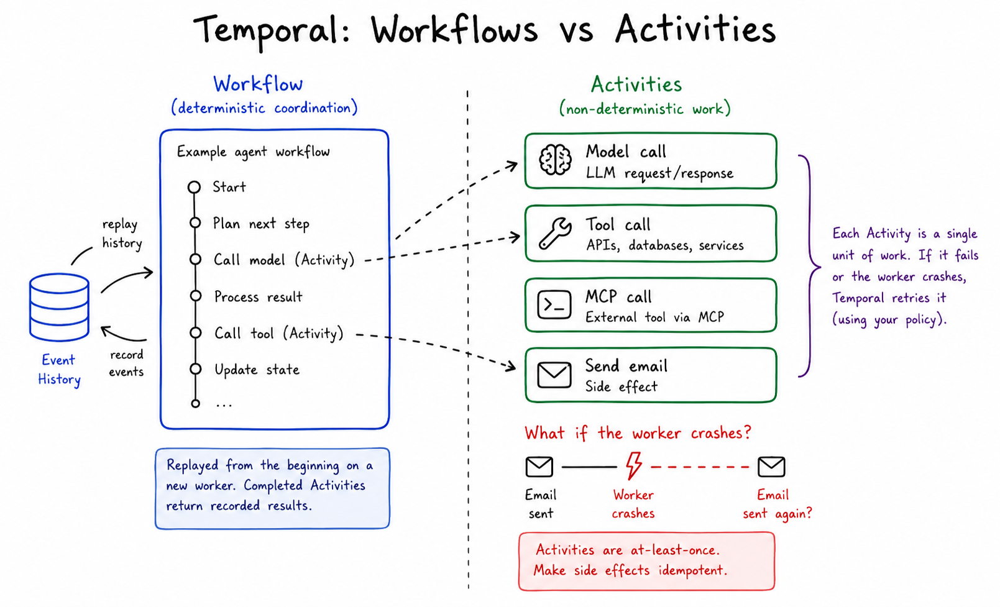
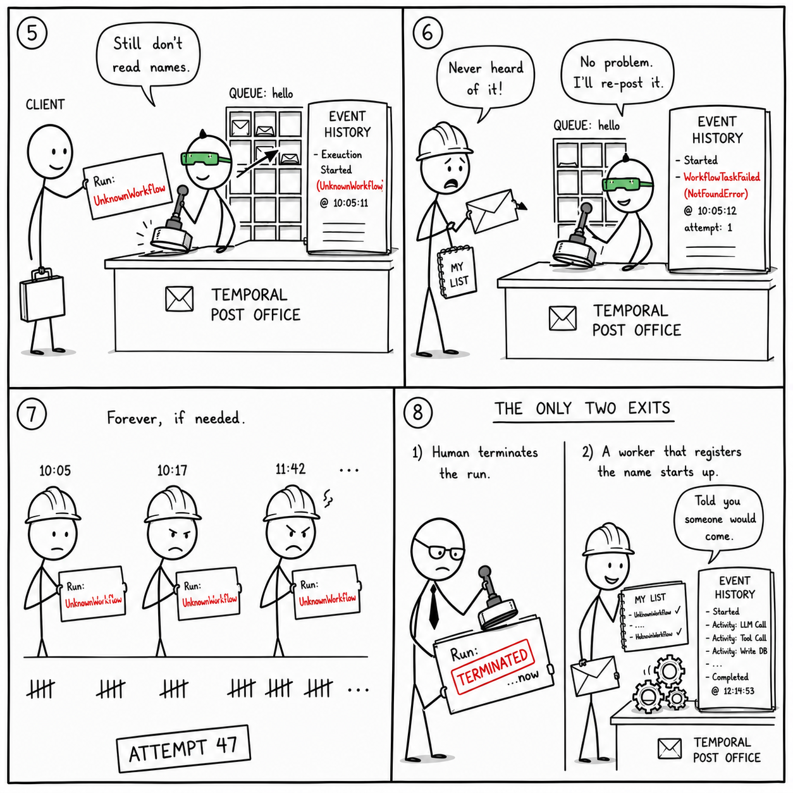
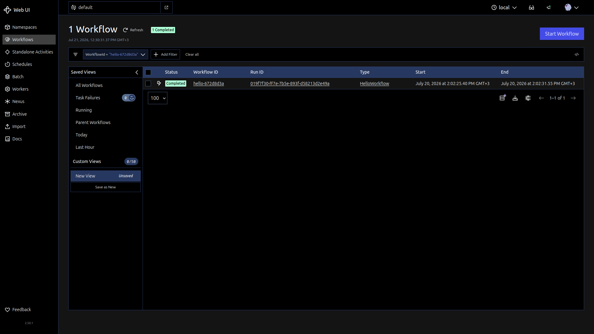
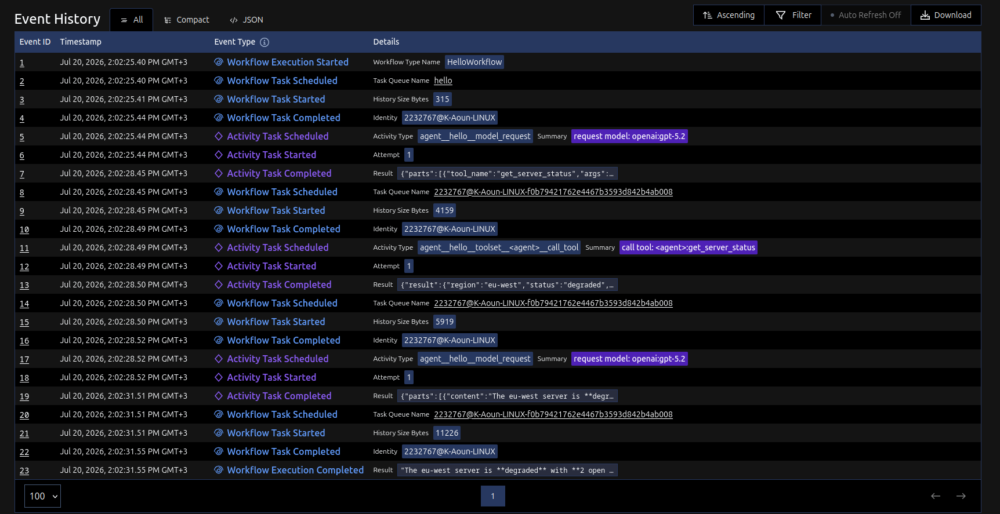
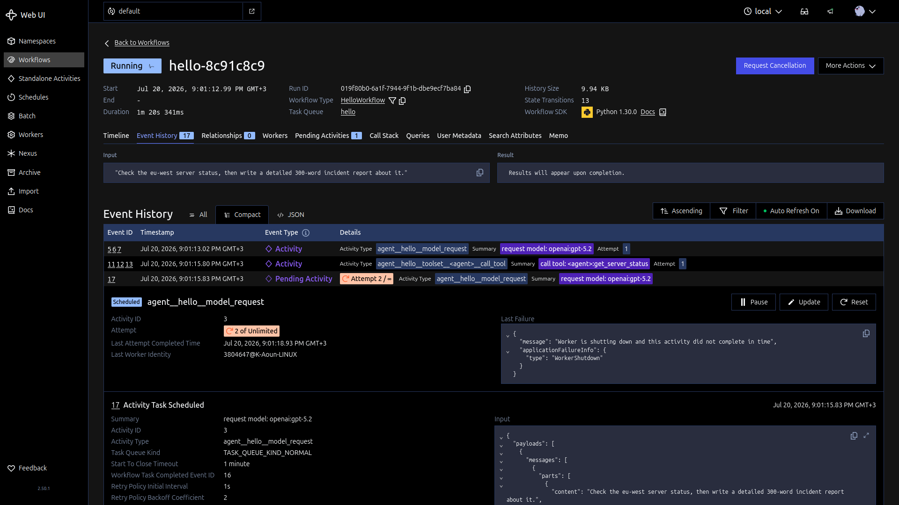
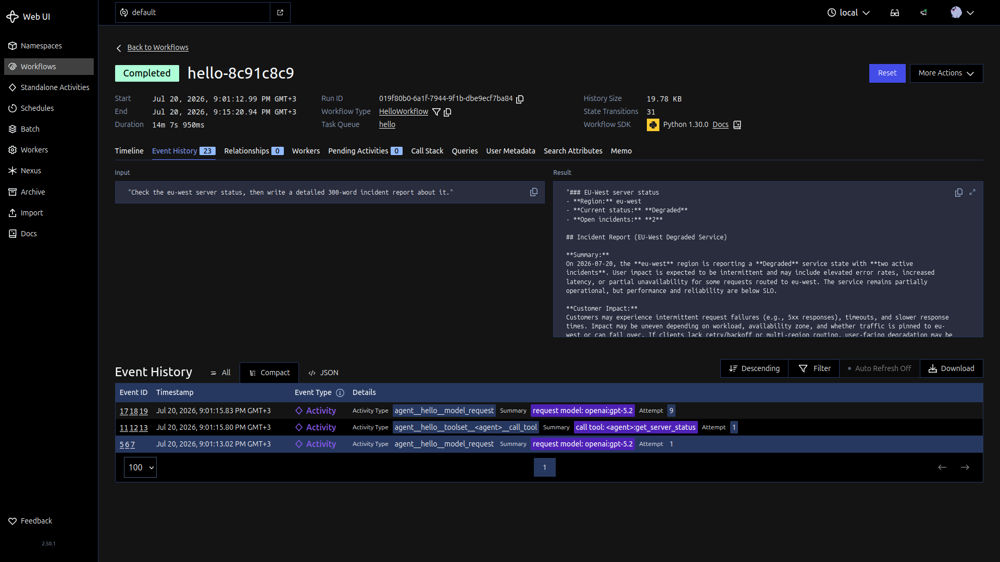
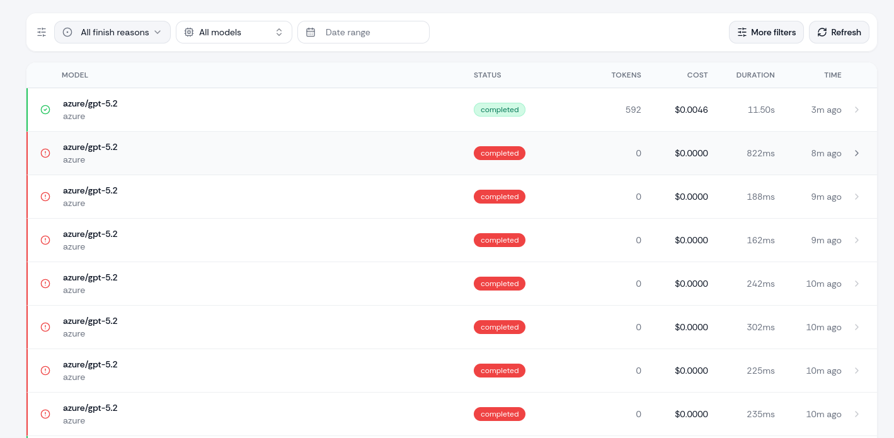
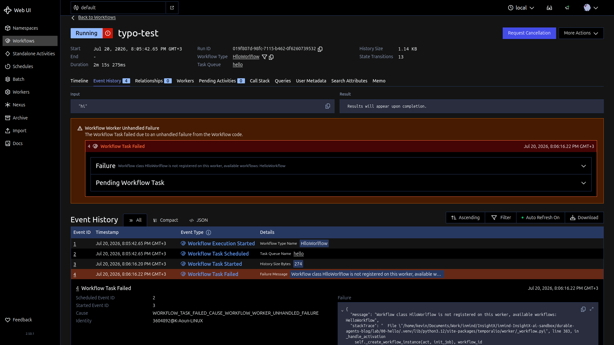

## Contents
{: .no_toc .post-toc-title }

* TOC
{:toc}


---

## Introduction

**Your agent works.** It plans, calls tools, writes the report..

Then you ship it, and one day it dies mid-run. A deploy restarts the container, or the API rate-limits. The run had already made twenty model calls, and now they're gone.

Durable execution is the fix the industry settled on, and [Temporal](https://temporal.io/) is a prominent name behind it: a [$300M Series D in February 2026](https://temporal.io/blog/temporal-raises-usd300m-series-d-at-a-usd5b-valuation), [Replit's agent running on it](https://temporal.io/resources/case-studies/replit-uses-temporal-to-power-replit-agent-reliably-at-scale), and OpenAI and Lovable on its user list (their claim, not mine).

Temporal now also has integrations with most agent orchestration frameworks: 
- [Pydantic AI shipped native support in November 2025](https://temporal.io/blog/build-durable-ai-agents-pydantic-ai-and-temporal)
- [OpenAI Agents SDK integration went GA in March 2026](https://temporal.io/blog/announcing-openai-agents-sdk-integration)
- [LangGraph got an official plugin in July 2026](https://temporal.io/blog/temporal-langgraph-plugin-durable-execution).

So apparently "durable" is everywhere now. But what does it physically mean? 

Instead of starting with a framework comparison, let's actually make it happen and check what's under the hood. 

---
## 1. Laying the Foundations (quickly)

*You can skip directly to [Setup] for hands on code. This section explains visually how Temporal works under the hood.*

You might be asking yourself a very valid question: 

> *How does Temporal replay my flow if it contains non-deterministic steps like LLM calls, which change from run to run?* 

If you did, good question. 

Temporal defines **Workflows** and **Activities**. 

**Workflows** are **deterministic and programmatic**, while **Activities** are **non-deterministic**.

When replaying your run, Temporal starts from the beginning and executes workflow steps programatically. When it encounters an activity, it has 2 options: 
- If the activity has been already executed on the previous run -> directly return the previous final result (ex. `"function_tools": [{"name": "get_server_status"}]`)
- If the activity was the one interrupted, run it again from 0




*Workflows decide, activities do. Every completed activity's result lands in the event history.*

### The Dispatch Model

This is how a request is submitted to temporal. 
1. A client submits by name, then the server stores and queues without validation
2. Even if the run / client go offline, the queue (the post office) keep operating as normal, as long as workers are operational
3. The worker pulls a request blindly (whatever is pending on its queue) and resolves the name against its private registration dict; scenario A completes, scenario B (a typo in the name) loops on WorkflowTaskFailed forever with only two exits


*Scenario A. The server is a mailbox with a perfect memory, not a code registry.*


*Scenario B. A typo in the name loops on WorkflowTaskFailed forever*

---
## 2. Setup (60s)

It is worth watching what "durable" physically looks like for a single, boring, successful run.

So let's keep the setup simple, and focus on temporal itself: one agent, one tool, and the record it leaves behind.

The whole setup is three small files and two containers, and everything below is reproducible in about five minutes.

>[!check] We'll be using Pydantic AI with Temporal, because their integration is native and mature by now.  

*You can find all the code files in the github repo: https://github.com/kevin-aoun/blog/tree/main/tech/durable-agents*

```bash
pip install "pydantic-ai[temporal]"
export OPENAI_API_KEY="sk-..."   # + OPENAI_BASE_URL if you use a gateway
docker run --rm -p 7233:7233 -p 8233:8233 temporalio/temporal:latest server start-dev --ip 0.0.0.0
```

>[!info] Note
>The dev server keeps everything in memory, if you stop the container your histories are gone. 
>
>Add `--db-filename temporal.db` if you want runs to survive restarts.

Next, one agent with one tool, wrapped for Temporal:

```python
agent = Agent(
    "openai:gpt-5.2",
    instructions="You are a concise SRE assistant. Use your tool when asked about servers.",
    name="hello",  # This must stay stable!
)

# a dummy tool 
@agent.tool_plain
def get_server_status(region: str) -> dict:
    """Return the current status of the demo server in the given region."""
    return {"region": region, "status": "degraded", "open_incidents": 2}

# wrapping our Pydantic agent inside TemporalAgent
temporal_agent = TemporalAgent(agent)

@workflow.defn
class HelloWorkflow(PydanticAIWorkflow):
    __pydantic_ai_agents__ = [temporal_agent]

    @workflow.run
    async def run(self, prompt: str) -> str:
        result = await temporal_agent.run(prompt)
        return result.output
```

You will also find two more files matter:
- `worker.py`: a long-running process that executes the workflow and every activity, and 
- `run.py`: a starter that submits the request and waits. 

The Temporal server sits between them. It never runs your code. It records what your worker does and matches queued work to whichever worker polls for it.

Note that if you submit a run before starting a worker, the run sits in the queue, visibly pending in the UI, until a worker shows up.

>[!check] After running `run.py` and `worker.py`, you can open Temporal's UI on http://localhost:8233 and see the run's event history for yourself, as shown below


*The first run.*

## 3. Reading the history

Click on the run to investigate. 

Ours has 23 events, and they follow one repeating pattern: a Workflow Task (ex. 1-3: Scheduled, Started, Completed), which is the worker running the deterministic agent loop to decide what happens next, followed by an Activity Task (ex. 5-7), which is the actual **non-deterministic** work: **a model request or a tool call**.


*The whole run, as Temporal recorded it: 23 events, three activities, everything on Attempt 1.*

>[!example] Read as a conversation:
>- **Events 1 to 4**: the run starts -> a worker picks it up -> the loop decides "ask the model".
>- **5 to 7**: activity `agent__hello__model_request` runs. Event 7's recorded result is the model deciding to call `get_server_status`.
>- **8 to 10**: the loop decides "execute that tool call".
>- **11 to 13**: activity `agent__hello__toolset__<agent>__call_tool` runs; the tool's
  return value is recorded.
>- **14 to 16**: the loop decides "give the result back to the model"
>- **17 to 19**: second model request, the final text answer is recorded.
>- **20 to 23**: the loop decides "done"; event 23 stores the run's final output, queryable by workflow id until retention expires (72 hours by default after the run closes).

So all in all: 2 model calls and 1 tool call, each one its own activity with its own recorded input, output, and retry policy. 

There is a retry counter on each activity, and in a non-interrupted run it never moves. Durable retries mean that counter and its backoff schedule live in the history, not in the worker's memory. Hold that thought.

Also, activity names carry the agent name. The agent is named `hello`, so the request is named `agent__hello__model_request`. 

>[!check] That is what granularity means: the unit Temporal saves and retries is the individual call, not the whole agent.

>[!info] Note 
>Note that event 4 says `2232767@K-Aoun-LINUX`: the pid and hostname of
my worker. Physical proof of the division of labor: the server coordinates and records; the code, keys, and model traffic stay on your machines.

>[!error] Important Note
>An agent name is normally optional in Pydantic AI, but the Temporal integration requires it, since each activity "needs to have a name that's stable and unique" so that Temporal "knows what code to run when an activity fails or is interrupted and then restarted, even if your code is changed in between". 
>
>The same goes for toolset IDs, and renaming after deploying "would break active workflows": the history references activities by these names, and a renamed agent no longer matches its own history during replay. Check https://pydantic.dev/docs/ai/integrations/durable_execution/temporal for more details


---
## 4. Now, Kill the Worker

Everything above was a happy run. The whole promise of durability is surviving death, so let's cause one.

Run it again with a longer prompt (it widens the kill window):

```bash
python run.py "Check the eu-west server status, then write a detailed 300-word incident report about it."
```

While it's running, hit ctrl-C on `worker.py`. Then open the run in the UI:


*The run is not dead. It's waiting: Attempt 2 of Unlimited.*

Three things worth noticing:
- The completed activities are untouched, their results are already in the history.
- The interrupted model call is now a **Pending Activity**: Attempt 2 of Unlimited, with the failure reason recorded.
- The counter is frozen. Retries only burn when a worker actually tries, so no worker means no attempts. 

>[!ship] You can take a break here, the run will wait. maybe grab a coffee or something (that's what I did)

Now restart the worker:

```bash
python worker.py
```

The run completes within seconds. Temporal replays the workflow, feeds it the recorded results (no completed call re-runs), and re-executes only the interrupted activity, from zero.


*Same run, completed. Only the interrupted activity re-ran.*

>[!info] Why does ours say Attempt 9?
>You would expect to see Attempt 2, not 9. 
>The reason is my LLM gateway apparently had a bad evening and kept rejecting one request with a 400. 
>
>Temporal retried until the gateway recovered. That story (and when infinite retries are the *wrong* answer) is for the next post.
>
>

>[!check] The takeaway
>The run's life is not tied to any process. State lives on the server, code lives on workers, and workers are replaceable mid-run.


---

## Appendix

**Side note found from breaking things.** Names are matched by string at runtime, and nothing validates them at start time. 

If you submit a workflow with a typo in its type name, the server accepts it, the worker receives it, rejects it as unregistered, and the server retries it forever. 

The run just sits Running, accumulating `WorkflowTaskFailed` events, waiting for a worker that knows the name. This is actually deliberate: during a rolling deploy, "code not registered yet" is a temporary condition, so Temporal waits instead of failing the run. 

It also means a renamed agent is just a typo you made on purpose, and this is what would happen: a wait-forever loop. 

If you misspell the task queue instead, the task is never picked up at all.


*The typod run: accepted by the server, rejected by the worker, retried forever.*


**Note to self: why the server refuses to validate names (design rationale).**

- Patterns: competing consumers (pull-based work queue), smart endpoints / dumb pipes (domain knowledge only at the edges), event sourcing (server stores facts, not opinions), late binding (names resolve at dispatch, not at submission).
- The server never holds code, deliberately: Code, dependencies, keys stay on workers
- A server-side type registry would be stale by construction (workers boot, die, and deploy continuously), and start-time validation is a TOCTOU trap: passing the check guarantees nothing at execution time
- Precedents in the same pattern: RabbitMQ does not validate consumers can parse messages; Kafka brokers do not know schemas (Schema Registry is a separate optional component); load balancers do not know whether backends implement routes.

